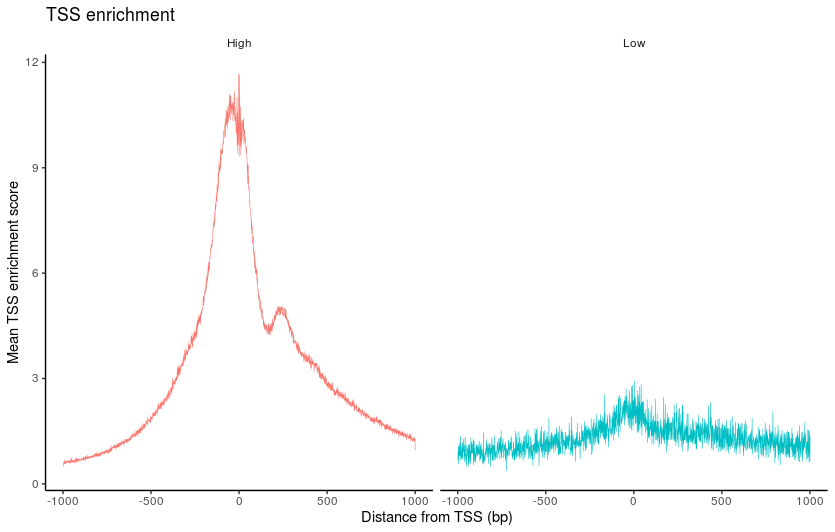

[toc]

### scATAC杂记  
[scATAC综述](https://wenku.baidu.com/view/49bfa4e05bf5f61fb7360b4c2e3f5727a5e9242d.html)
1. 目前的scATAC的peak富集率很低，通常需要和scRNA数据结合进行联合分析
2. scATAC数据分析的13个软件包:ChromVAR，SCRAT，scABC，Cicero，Scasat，ciscisic，snapATAC，epiScanpy，Destin，SCALE，scATAC-pro，Signac，ArchR。
3. 基因组区域的公共数据库（如cisBP，JASPAR，HOMER）
4. 批次效应指非生物学因素（技术差异）导致的差异。Harmony,Seurat,sc等在批次去除和生物学差异保护中表现出比较不错的平衡性。用于批次校正的数据整合工具也可以用于整合多组学scRNA-scATAC数据。

### sc-ATAC的10x质控  
1. TSS位点富集的peak，指标大于5%。
2. 获取到有效的10xbarcode的reads含量比例，要求大于40%

***
***
***

### sc-ATAC分析包
目前我使用的是与Seurat结合比较完善的Signac
**步骤：**
#### 一.读取数据和创建分析对象
(1) 读取count矩阵，一般为稀疏计数矩阵，和scRNA不一样的是，scATAC的稀疏矩阵行名不是gene而是一个基因区间，预计代表一个染色体的开放区域。矩阵中的数值表示map到该区域的reads条数。函数Seurat包中的 **Read10X_h5()** 
(2) metadata数据读取，该表格包含了更加全面的信息，例如：(每个细胞的reads总数，落在promoter区域的reads总数，没有map上的reads数，落在富集区域的reads数等)
(3) **CreateChromatinAssay()** 创建ChromatinAssay对象，需要输入上面的两个文件，为 **CreateSeuratObject()** 对象创建提供输入。注意后续分析motif时，这里建立的seqinfo要和UCSC等数据库的基因组名称对应，而且本身矩阵的名称也得对应
(4) 同时可以给创建好的对象添加已知注释。  

***

#### 二.质控
+ 需要考虑每个细胞核小体的信号强度**NucleosomeSignal()** ,计算 147 bp 和 294 bp（单核小体）之间的片段与 < 147 bp（无核小体）的片段的比率。
+ **TSSEnrichment()** 计算每个细胞的TSS富集分数和百分比，在峰值中添加黑名单比率和reads在peak上的百分比。
+ 根据富集分数分高富集细胞，和低富集细胞，绘制TSS上下游的情况

+ 查看所有细胞片段长度周期，并且按照核小体的信号强度对其进行分组。

+ 小提琴图查看
    + reads在peaks上的比例
    + peaks上的reads数目
    + TSS_Enrichment的百分比
    + blacklist的百分比
    + 核小体信号强度  

+ 质控删除异常细胞，根据上述小提琴图的标签进行特定指标质控。指控完成后的小提琴图如下：

***

#### 三.归一化、降维
+ Signac执行[TF-IDF](https://blog.csdn.net/qq_45893319/article/details/119278730)(**频率-逆文档频率**)进行归一化,TF-IDF这里是一个两步归一化的过程，既跨细胞归一化以校正细胞测序深度的差异，又跨峰归一化以为更罕见的峰提供更高的值
+ 特征峰选择，就像scRNA选择高变基因，scATAC也可以选择最特征的峰进行下游分析**FindTopFeatures()**
+ 降维，在TF-IDF的归一化后进行线性降维，用的是[奇异值矩阵分解SVD](https://blog.csdn.net/qq_58535145/article/details/122651843)
+ TF-IDF 和 SVD 的组合步骤被称为潜在语义索引 (LSI)
+ 第一个 LSI 组件通常捕获测序深度（技术变异）而不是生物变异。如果是这种情况，则应从下游分析中删除该组件。
可以使用 DepthCor() 函数评估每个 LSI 组件和测序深度之间的相关性

+ 非线性聚类UMAP，运行完后S4对象中command多了一个RunUMAP.peaks.lsi的S4对象。继而运行**FindNeighbors()** 找临近细胞，**FindClusters()** 通过之前的共享最临近(SNN)模块化优化的聚类算法识别细胞簇。
+ **Dimplot()** 绘制细胞分群图谱

***

#### 四.构建基因活性矩阵
+ 预测RNA的表达量信息，也可以为后续与scRNA数据整合做准备，目前arc联合建库就不需要用这种方法，因为10xbarcode对应的细胞就可以让其进行与scRNA数据的整合。
+ 提取基因坐标上游2k区域（作为启动子区域）
+ 然后使用**FeatureMatrix()** 函数计算映射到每个区域的reads数目，由**GeneActivity()** 自助完成。
+ 创建的基因活性矩阵添加到scATAC对应的S4对象中。
+ 可与scRNA进行数据整合，根据构建的scATAC活性矩阵的RNA矩阵对应到真实的scRNA数据矩阵，可以使用CCA来找寻互相的锚点来整合数据，然后转换label。
+ 可视化对比整合数据的结果

+ 整合数据后就可以对特定群体进行进一步分析和可视化了

*** 

#### 五.差异分析
+ 寻找差异peak区域(例如"CD4 Naive","CD14+ Monocytes"两个群体)
    + 首先确定S4默认对象为peaks
    + **FindMarkers()** 来寻找deg_peaks（由于稀疏矩阵scATAC，通常min.pt参数要比分析scRNA默认值0.1小）
    + 也可以通过**FoldChange()** 函数寻找fold比较大的区域，（但是这种方法无法考虑潜在变量，例如：细胞之间的总测序深度的差异，并且不执行任何统计测试），优点是可以快速浏览数据
+ 找临近gene
    + 由于找到deg_peak后，峰的坐标不容易解释，那么就需要寻找其邻近的gene，**ClosestFeature()**
+ 绘制两个群体指定差异区间的绘图展示

