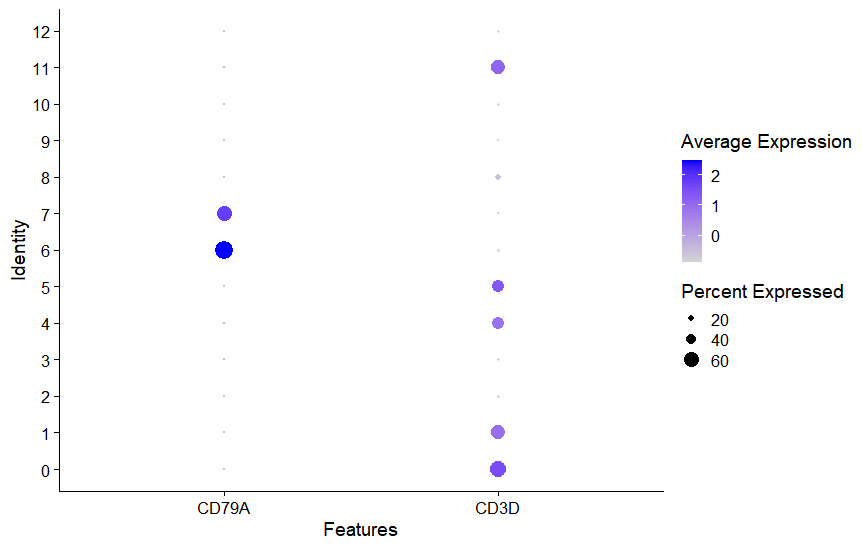

#
单细胞流程简述
  
[toc]
##一. Cell Ranger
cellranger单细胞分析流程主要分为：数据拆分cellranger mkfastq、细胞定量cellranger count、组合分析cellranger aggr、参数调整cellranger reanalyze。
**1. 拆分**
   + 首先对illumina下机的BCL格式的数据进行转fastq
  [cellranger mkfastq](https://support.10xgenomics.com/single-cell-gene-expression/software/pipelines/latest/using/mkfastq#example_data)具备这个功能，封装了Illumina's bcl2fastq软件，用来拆分Illumina 原始数据（raw base call (BCL)），输出 FASTQ 文件。

**2. 计数**
   + count是cellranger最主要也是最重要的功能：完成细胞和基因的定量，也就是产生了我们用来做各种分析的基因表达矩阵。
   + 在由 cellranger mkfastq 解析用的每个 GEM 上运行 [cellranger count](https://support.10xgenomics.com/single-cell-gene-expression/software/pipelines/latest/using/count#args)。 对于 [Targeted Gene Expression](https://support.10xgenomics.com/single-cell-gene-expression/software/pipelines/latest/what-is-targeted)文库，可以参阅[靶向基因表达分析](https://support.10xgenomics.com/single-cell-gene-expression/software/pipelines/latest/using/count-targeted)以获取有关如何提供目标基因面板信息的说明。 如果在 Gene Expression 库旁边创建了一个 [Feature Barcode](https://support.10xgenomics.com/single-cell-gene-expression/software/pipelines/latest/feature-bc) 库，可以将它们都传递给 cellranger count。 有关详细信息，请参阅[Feature Barcode Analysis](https://support.10xgenomics.com/single-cell-gene-expression/software/pipelines/latest/using/feature-bc-analysis)分析。
   + !!!使用cellranger count比对参考基因组前，要对参考基因组进行处理:
     +  首先使用cellranger mkgtf对参考基因组的gtf进行处理
     +  使用cellranger mkref对参考基因组的fa和上一步处理过的gtf进行处理得到的文件是cellranger count分析做准备的处理过后的参考基因组信息，处理过的文件夹中包含了染色体长度信息，染色体名字信息，染色体开始位点信息等等文件。

详情可以查看10x官网介绍<https://support.10xgenomics.com/single-cell-gene-expression/software/pipelines/latest/what-is-cell-ranger>

####cell ranger 数据分析概述
Cell Ranger是由10x genomic公司官方提供的专门用于其单细胞转录组数据分析的软件包。Cell Ranger将前面产生的fastq测序数据比对到参考基因组上，然后进行基因表达定量，生成细胞-基因表达矩阵，并基于此进行细胞聚类和差异表达分析。  
详情见简书<https://www.jianshu.com/p/f0f6ae624c00>  
可以看到cell ranger也可以做PCA降维，聚类分群，差异分析等等操作。但是一般使用的是Seurat包进行后续分析

**疑问:** cell ranger在比对那一步，先把reads比对到参考基因组的fa，根据gtf对基因功能区域进行位置识别，MAPQ校正后，再取外显子上的read比对到参考的转录本上，比对上转录本的才算UMI计数，这个参考转录本是怎么得到的呢，是根据参考基因组的fa和gtf的区域识别5'和3'端吗还是识别什么特定区域或者软件算法识别的？

##二. Seurat对cell ranger得到的表达矩阵进行分析
Seurat官网详细教程<https://satijalab.org/seurat/articles/pbmc3k_tutorial.html>(该网站没有做样本的批量校正过程)
对应的脚本[R脚本](seurat流程分析.R)
**概述：**
1. 用read10x()读cell ranger得到的表达矩阵
2. CreateSeuratObject()创建Seurat对象，合并样本的Seurat对象
3. PercentageFeatureSet()计算细胞的线粒体基因的转录本百分比(pattrn参数可以指定需要匹配的字段来进行筛选所需要的处理的基因，可以不是线粒体)，比例高的细胞多数归于细胞凋亡进行过程，所以在后面可能是要舍弃的。
4. VlnPlot()做可视化小提琴图"nFeature_RNA", "nCount_RNA", "percent.mt"分别代表了基因的数目，mRNA的数目，线粒体mRNA的百分比
    
   
   ***
小提琴图
***
    
6. subset()用subset参数给于细胞内基因数目选择条件来过滤空胞和多胞的情况，再筛选控制线粒体百分比在5以下的细胞做后续分析
7. FeatureScatter()来画"nFeature_RNA", "nCount_RNA", "percent.mt"的相关性图，pearson系数会显示在图上方
    
   
   ***
质控QC
***
    
8. NormalizeData()对数据进行标准化类似于FPKM的意思
9.  FindVariableFeatures()对标准化后的数据选取高变基因，根据选取的高变基因来做PCA降维分析。
    **注:** **高变基因:** (在不同的细胞表达变化非常大),因为单细胞中数据量庞大，可选取分析的特征非常的多,对特征明显的基因进行更细致分析，这样就显著减少了运算量,而且还可以更明显的区分出主成分信息，以此来对细胞进行降维聚类。
    **eg:** 如何区分两个不同的人？
    人有很多特征，明显的特征就例如高矮胖瘦，这特征明显的就可以区分不同的人，PCA分析就是这样把细胞数据进行降维，挑选出主成分最高的特征进行分类
     
      
    ***
高变基因筛选
***
     
10. ScaleData()用于PCA之前的数据预处理
    + 改变每个基因的表达，使跨细胞的平均表达为 0
    + 缩放每个基因的表达，使细胞间的方差为 1
      + 此步骤在下游分析中给予同等权重，因此高表达基因不会占主导地位    

    + ***问题：*** 为什么之前做表达量均一化了，这里又要做一个scale呢？
    我的理解：可能是由于类似于高表达基因的影响对PCA太大了，在PCA中例如一个gene的表达量是80到100，另一个是0.01-0.06，显然两个基因的表达量就差距很大，可能会导致PCA降维出现问题或者结果不满意，我们就需要对数据进行压缩处理，进行归一化。这样可以把数据的这个差距尽可能缩小。

    + **需要注意的是：** 该函数有一个feature指定数据集功能，不加该参数，就会默认标准化之前2000个高变基因，加上了feature指定就会对指定数据集做标准化。高变基因的标准化可以作用于PCA处理，但是不能做热图。所有基因的标准化才可以做整体gene的一个热图。

11. RunPCA()根据高变基因来对数据集进行降维
    VizDimLoadings(),DimPlot()对PCA进行可视化
    **确定数据集的分群个数：**
    + **ElbowPlot()** 碎石图(基于每个主成分对方差的解释率的排名)这个图主要是为了让我们直观的看出PCA的组分数目到达一个什么程度的时候可以基本区分样本间的关系。这也是为后续tSNE或者UMAP的分析做处理，我们选取的多少个PCA组分，后续tSNE或者UMAP对我们数据进行处理的时候就会直接使用我们PCA得到的组分结果进行聚类分析。
     
    
     ***
肘部图（碎石图）
***
     

    + **Jackstraw：**  Jackstraw置换检验算法；重复取样（原数据的 1%），重跑PCA,鉴定p-value较小的PC；计算‘null distribution’(即零假设成立时)时的基因 scores。根据绘制出来的图形看P值，一般小于0.01的都可以选择，当然我觉得也不宜过多。 
     
    
     ***
JackStraw
***
          

12.  聚类分群
    FindNeighbors()计算给定数据集的 k.param 最近邻。 也可以选择（通过 compute.SNN），通过计算每个单元格与其 k.param 最近邻居之间的邻域重叠（Jaccard 指数）来构建共享的最近邻图。
    FindClusters()优化模型，resolution 参数决定下游聚类分析得到的分群数，对于3K左右的细胞，设为0.4-1.2能得到较好的结果(官方说明)；如果数据量增大，该参数也应该适当增大。

13. 非线性降维
    tSNE或者UMAP降维
    RunTSNE()，TSENplot()，Dimplot()，FeaturePlot()显示细胞分群特征或者样本的细胞分布特征等等
     
    
     ***
TSNE聚类分群图
***
    可以看出有些点和自己的分群不同，这是由于tSNE内部算法导致的，首先相同颜色的点是根据Louvain算法(聚类算法)去计算得到的，但是画图的时候点与点之间的距离是tSNE中可视化的算法或者公式做的，虽然根据Louvain算法这些点是一类的，但是在可视化的算法或者公式中他们分开了。
    **需要注意的一点:** tSNE和UMAP在处理数据文件的时候，处理的是PCA已经降维了的数据，取多少个最显著的PCA组分，然后这每一个PCA组分就是对于细胞的一个特征(个人理解就是PCA是以每个细胞为观测样本，gene的表达量为观测值，而tSNE是以每个细胞为观测样本，PCA组分的值为观测值。)，在根据这个特征对每个细胞进行二次降维，让其反映在坐标轴上，而点的颜色分类是用Louvain算法根据PCA结果来得到的。
     
    
     ***
样本分类图
***
     
14. markgene
    得到了细胞聚类分群图后要对其分类进行类型定义，这就需要用到markgene来定义这些聚类的细胞属于哪一类。
    **可以参考的鉴定步骤：**
    （1）从已有研究基础，样本特性等预估样本中潜在有哪些细胞亚群；
    （2）搜寻对应细胞亚群的已知基因标记；
    （3）基于已知基因标记进行亚群分类识别；
    （4）对于依然无法定义的细胞亚群，也可以直接从亚群上调表达的基因去推测其潜在类型。或者，可以考虑，从其他物种或者组织文献的相关报道中推测
15. **FindMarkers()有ident.1和ident.2参数去找不同群类的不同的markgene**
     DotPlot()的feature参数可以设定markgene去看气泡图区分聚类的分群状况
     
    
    ***
细胞分类气泡图
***
     
    也可以使用FeaturePlot()查看markgene在分群中的群体位置的可视化图
     
    
    ***
FeaturePlot可视化
***
     

## 三. 批量校验
**1. CCA校验** 
+ 在合并样本之前就需要做CCA校验
  1. 创建每个样本的Seurat对象，并按条件对每个样本都过滤掉一些细胞
  1. 对没样本进行归一化NormalizeData()
  2. 对归一化的每个样本都进行高变基因筛选FindVariableFeatures()，并筛选出共同的高变基因SelectIntegrationFeatures()
  3. FindIntegrationAnchors()函数助于CCA识别数据链接锚
  4. IntegrateData()数据合并进行后续聚类分群等操作(由于之前做了过滤和高表基因筛选所以这些步骤都可以跳过直接做PCA降维和tSNE、UMAP等)

**2. harmony校正**
+ 在PCA之后做harmony校验

**批量校验具体细节可查看** 
[Seurat分析流程ppt](索引文件/seurat分析流程实操.pdf)

