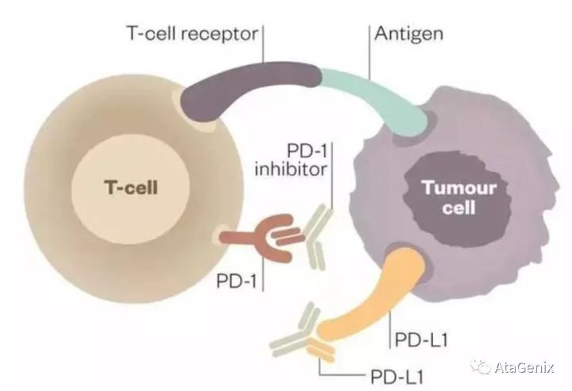

[toc]

### 名词解释
1. 体外转录，IVT
2. [PBMC](https://baike.baidu.com/item/%E5%A4%96%E5%91%A8%E8%A1%80%E5%8D%95%E4%B8%AA%E6%A0%B8%E7%BB%86%E8%83%9E/829194?fromtitle=PBMC&fromid=4930057&fr=aladdin):外周血单个核细胞(外周血是除骨髓之外的血液)
 
3. 免疫耐受：是指对抗原异常性应答的T细胞和B细胞，在抗原的刺激下，不能被激活，不能产生特异性免疫效应细胞以及特异性抗体，从而不能执行正常的免疫应答现象。
+ 形成的这种机制的原因有：
  + 固有性免疫耐受
  + 适应性免疫耐受

**4. 免疫检查点：** 指程序性死亡受体以及其配体，基于程序性死亡受体以及配体的免疫检查点阻断疗法通过抑制程序死亡受体以及配体的结合，从而提高宿主免疫系统对肿瘤细胞的攻击性。
举例：PD-1/PD-L1免疫抑制剂抗肿瘤原理：

程序性死亡分子1及其配体（PD-1/PD-L1）是一对负性免疫共刺激分子, 正常情况下, 组织细胞表面的PD-L1与淋巴细胞表面的PD-1结合后, 可抑制淋巴细胞功能, 诱导活化的淋巴细胞凋亡, 从而发挥自身免疫耐受作用。然而多种肿瘤细胞表面也表达PD-L1, 肿瘤细胞表达的PD-L1, 可与相应淋巴细胞表面的PD-1结合, 抑制淋巴细胞的功能及细胞因子的释放, 并诱导淋巴细胞凋亡, 导致肿瘤细胞发生免疫逃逸。因此，阻断PD-1/PD-L1通路可以增强淋巴细胞活性以达到肿瘤免疫治疗的效果。

5. TCR：T细胞抗原受体，TCR为所有T细胞表面的特征性标志，以非共价键与CD3结合，形成TCR—CD3复合物。TCR的作用是识别抗原。

6. 调节性T细胞（T reg）：抑制性T细胞的一种功能亚群，Foxp3是天然Treg的标志。
+ 调节性T细胞分为两类：
  + 天然Treg（n Treg）
  + 获得性Treg（a Treg）
+ 目前认为天然Treg来源于胸腺，主要通过细胞接触机制发挥抑制功能
+ 获得性Treg是外周血成熟T细胞在持续性抗原刺激以及IL-10、TGF-β等细胞因子诱导下产生的

### 问题杂记
***1. SNV(single nucleotide variants)和 SNP(single nucleotide polymorphism)有什么区别?***
+ 性质不同
  + SNV：SNV是一种由单个碱基改变发生的突变。
  + SNP：SNP是一种DNA序列多态性。

+ 产生原因不同
  + SNV：SNV的产生原因是碱基替换、单碱基插入或碱基缺失等。
  + SNP：SNP的产生原因是在基因组水平上由单个核苷酸的变异。

***2. PCR文库杂记：***
  + 一般在建库中的RNA的逆转录还需要进行双链扩增第一是为了满足PCR的上机测序需求，单链容易发生降解，PCR扩增用到的是DNA聚合酶，DNA聚合酶只对双链有效，一般的文库都属于非特异性文库，不能区分“+,-”链。

***3. 技术重复和生物学重复：***
+ 技术重复是对同一样本进行重复检测分析。
+ 生物学重复是经过相同处理方式的相同样本。
   
***[4. Crispr/Cas技术：](https://www.jianshu.com/p/e6b9a577ff51)***
[英文介绍](https://www.addgene.org/guides/crispr/)
+ Crispr/Cas系统是一种原核生物的免疫系统，用来抵御外源遗传物质的入侵，比如噬菌体病毒和外源质粒。同时它为细菌提供了获得性免疫，类似于哺乳动物的二次免疫。Crispr/Cas系统能识别外源DNA，并将其切断，沉默其表达
+ 由于这种精确的靶向功能，Crispr/Cas系统被开发成一种高效的基因编辑工具。Crispr/Cas系统有多种类型，目前使用最成熟研究最深入的是Cripsr/Cas9

***5. 回文序列：***
+ 双链DNA或RNA分子中的特定的核苷酸片段，该片段在其中一条链上按5'到3'读取的序列与其互补链上按相同的5'到3'读取的序列一致。回文序列的单链DNA或RNA，存在对称中心，对称中心两侧碱基关于该对称中心对称，可形成互补。故回文序列能够形成发夹结构（茎环结构）。
+ 回文序列广泛存在于各种生物体基因组中，主要和转录终止有关，也是限制性内切酶酶切位点，还参与DNA复制等生命活动。